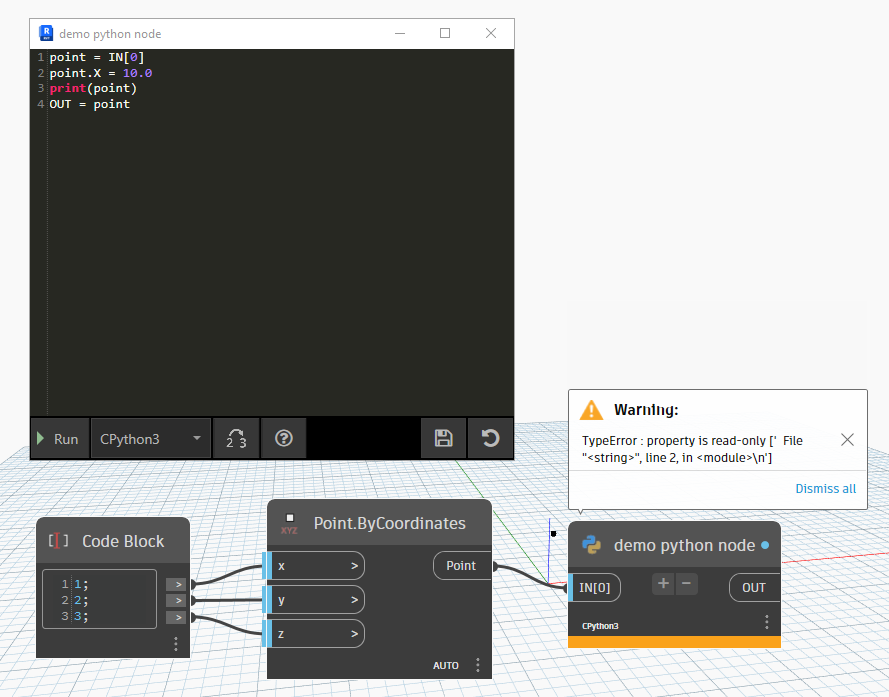
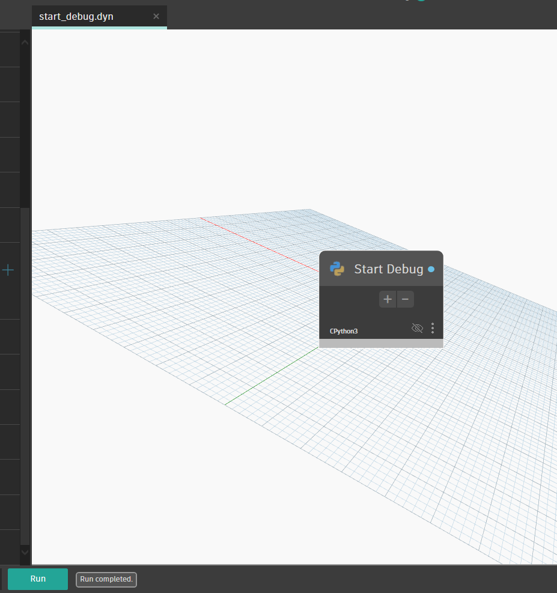
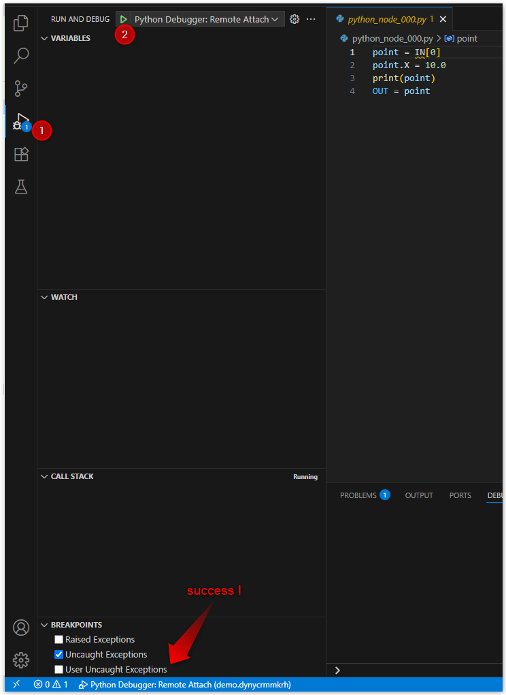
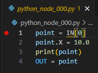
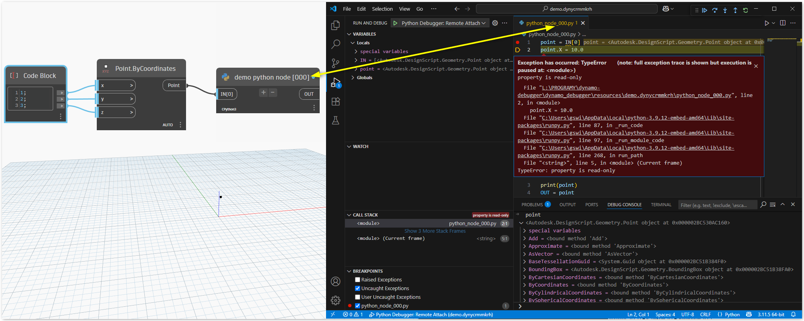

# Dynamo Python Node Debugger

This tool makes it easy to debug Python nodes in Dynamo for Revit. Currently, it only supports CPython3 and integrates with Visual Studio Code for debugging.

## Requirements

- Dynamo for Revit
- Python 3.x
- Visual Studio Code

## Installation

```bash
python -m pip install "git+https://github.com/gswifort/dynamo_debugger@v0.1.0"
```

## Usage

1. Create Dynamo project

   

2. Run ``dynamo_debugger`` script

   ```bash
   python -m dynamo_debugger demo.dyn
   ```

3. A temporary project directory has been created in the Dynamo source files folder

   ```raw
   .
   ├── demo.dyn
   └── demo.dynycrmmkrh/
      ├── .vscode/
      │   └── launch.json
      ├── _node_id_to_file.json
      ├── demo.dyn
      ├── python_node_000.py
      └── start_debug.dyn
   ```

4. Open ``start_debug.dyn`` in Dynamo to start debugging (only once per Dynamo session)

   

5. Start debug session in VSCode

   

6. Add breakpoints in the Python nodes in VSCode

   

7. Open temporary source file in dynamo and run script

   

## License

MIT License
